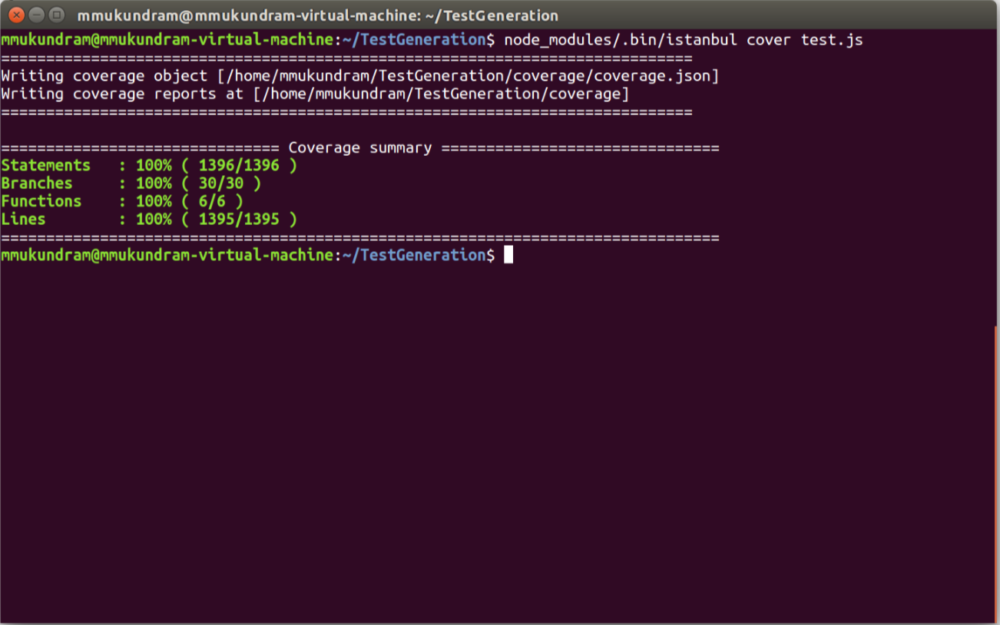

# DevOps CSC 519 HW 2
Mukundram Muraliram
mmurali5@ncsu.edu
200158869

### Setup

	git clone https://github.com/mmukundram/HW2.git
	cd HW2
	npm install

### Generating Tests

	node main.js <target_file> 

### Getting a simple coverage report

	node_modules/.bin/istanbul cover test.js

### Generated coverage report

